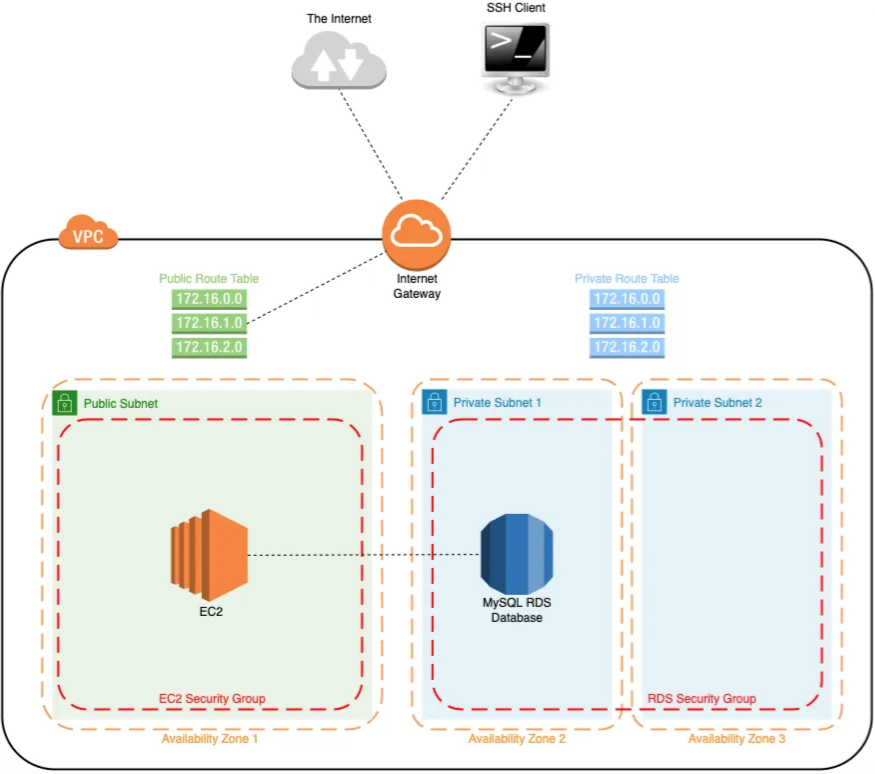

# Projeto de Infraestrutura AWS com Terraform

Este projeto configura uma infraestrutura AWS utilizando Terraform. Ele inclui a criação de uma VPC, sub-redes públicas e privadas, tabelas de rotas, gateways de internet, grupos de segurança, instâncias EC2, RDS, e S3.

## Arquitetura



## Estrutura do Projeto

O código Terraform neste projeto define os seguintes recursos:

- VPC
- Internet Gateway
- Subnets (Públicas e Privadas)
- Route Tables e Associações de Route Tables
- Grupos de Segurança para EC2 e RDS
- Subnet Group para RDS
- Instância de Banco de Dados RDS
- Par de Chaves para EC2
- Instância EC2
- Elastic IP
- Bucket S3

## Pré-requisitos

Certifique-se de ter os seguintes itens configurados antes de iniciar:

- Conta AWS com as credenciais configuradas.
- Terraform instalado na sua máquina.
- Chave SSH pública disponível para ser usada no par de chaves do EC2.

## Como Usar

0. Clone este repositório para a sua máquina local.

1. Configure o backend do Terraform no arquivo `providers.tf`.

2. Configure os valores das variáveis no arquivo `variables.tf`.

3. Configure os valores das variáveis no arquivo `secrets.tfvars`.

4. Inicialize o Terraform:

    ```bash
    terraform init
    ```

5. Formate o código para garantir que esteja de acordo com as convenções do Terraform:

    ```bash
    terraform fmt
    ```

6. Valide a configuração:

    ```bash
    terraform validate
    ```

7. Planeje a execução para revisar as alterações que serão feitas na infraestrutura:

    ```bash
    terraform plan -var-file="secrets.tfvars"
    ```

8. Aplique as alterações para criar a infraestrutura:

    ```bash
    terraform apply -var-file="secrets.tfvars"
    ```

9. Para destruir a infraestrutura quando não for mais necessária:

    ```bash
    terraform destroy -var-file="secrets.tfvars"
    ```

## Considerações Finais

Certifique-se de proteger suas credenciais e informações sensíveis. Não compartilhe arquivos como `secrets.tfvars` publicamente. Para mais informações sobre o Terraform, consulte a [documentação oficial](https://www.terraform.io/docs).

---

Este README fornece uma visão geral básica do projeto e como utilizá-lo. Adapte conforme necessário para atender às necessidades específicas do seu projeto e ambiente.
